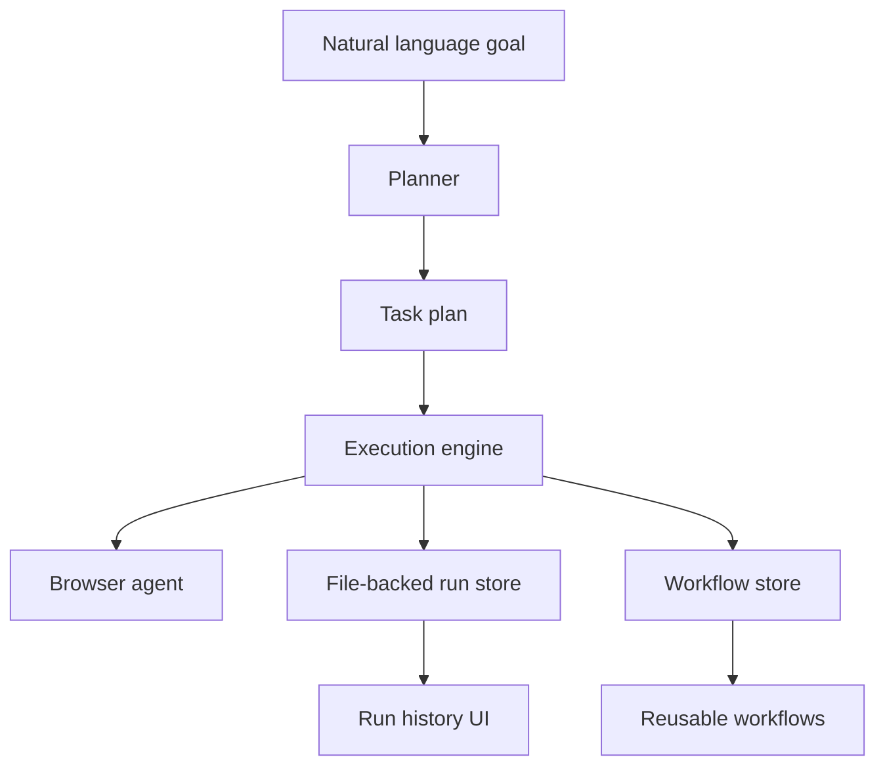

# Legwork Architecture

## Assessment

The repository started empty, so the implementation was built as a fresh modular TypeScript application instead of a refactor of existing code.

The design centers on six concrete subsystems:

1. Planner
2. Execution engine
3. Browser agent
4. History and workflow persistence
5. Controlled self-improvement layer
6. React dashboard and API surface

The system is intentionally file-backed first. That keeps the V1 stack easy to run locally, inspect, and extend before introducing queues or a database.

## Directory Layout

- `src/core/` - plan and run domain models, planner, and execution engine
- `src/browser/` - Playwright browser abstraction and recovery logic
- `src/storage/` - file-backed run persistence
- `src/workflows/` - reusable workflow storage and replay helpers
- `src/improvement/` - internal agents, observation analysis, proposal generation, branch/PR services
- `src/server/` - Express API
- `src/runtime/` - in-memory credential vault and browser session registry
- `web/` - React dashboard
- `test/` - unit tests for the core behaviors
- `.legwork/` - runtime artifacts created at execution time

## Core Flow

### Planner

`src/core/planner.ts` converts a goal into a deterministic plan. It:

- Splits the goal into clauses
- Infers browser-oriented steps, including a seeded search step for browser-heavy or research-oriented goals
- Marks login, payment, account-state, and other irreversible work with approval gates
- Appends checkpoint and consolidation steps

`src/core/plan-service.ts` adds an optional LLM-assisted planner when `OPENAI_API_KEY` is available. The deterministic planner remains the fallback, so the system is still usable without networked model access. The UI requests a fresh plan from the current goal and context before review or execution, so edits do not reuse stale task lists.

### Execution Engine

`src/core/execution-engine.ts` runs a `TaskPlan` step by step.

Behavior:

- Saves a new run before execution starts
- Emits structured events for each step
- Retries failed steps with backoff
- Pauses on approval gates
- Persists checkpoints after every state change
- Supports `resume()` from a saved checkpoint
- Supports detached background execution so the UI can poll live progress while work continues
- Captures a screenshot artifact after browser-oriented steps for review
- Writes a final `summary.md` and `summary.json` artifact into `.legwork/artifacts/runs/<runId>/`

### Browser Agent

`src/browser/playwright-browser-agent.ts` wraps Playwright and adds practical recovery:

- Fallback locator resolution for selectors, labels, placeholders, roles, and text
- Login support using runtime-supplied credentials only
- Select, checkbox, upload, wait, and structured extraction helpers
- Transient error detection
- Retry with page reload and backoff
- CAPTCHA, 2FA, login-wall, and other challenge detection
- Screenshot capture into `.legwork/artifacts`

The browser agent is a concrete implementation, not a mock. It can be used directly from the execution engine or from future specialized agents.

### Runtime Sessions

`src/runtime/credential-vault.ts` stores credentials only in memory, keyed by ephemeral session id. `src/runtime/session-registry.ts` keeps paused browser sessions alive across approval gates when the process remains up.

Credentials are never written to `.legwork/` or any other local file by the app. Runs refer to a runtime credential session id, not to raw secrets.

### Persistence

`src/storage/file-run-store.ts` stores each run as JSON.
`src/workflows/workflow-store.ts` stores successful workflows as JSON and can render them as Mermaid.

This gives the app:

- Full execution history
- Checkpoint state
- Replayable workflow definitions
- Human-inspectable artifacts without needing infrastructure

## Controlled Self-Improvement System

The improvement system is designed as a constrained internal loop:

Observe -> Analyze -> Identify problems -> Generate proposals -> Design -> Implement on branch -> Test -> Security/Architecture review -> Open PR -> Human approval -> Measure impact

### Internal Agents

`src/improvement/agents.ts` defines the internal roles:

- Manager
- Performance Analyst
- Architect
- Engineer
- QA
- Security

These roles are structural first. They define responsibility, output, and permission boundaries inside the codebase.

### Observation Hooks

Run records contain:

- Status
- Step-by-step events
- Output artifacts
- Checkpoint data
- Failure messages

`src/improvement/observation-hub.ts` converts run history into summary metrics. `src/improvement/proposal-engine.ts` turns those metrics into concrete proposals.

### Branch and PR Capability

`src/improvement/branch-service.ts` can:

- Create a feature branch
- Detect GitHub CLI availability
- Push to origin

`src/improvement/pr-service.ts` can open a draft PR with `gh pr create`.

The implementation deliberately does not merge or deploy anything. Human approval remains mandatory at the PR boundary.

## API Surface

`src/server/app.ts` exposes a small JSON API:

- `POST /api/plan`
- `GET /api/credential-sessions`
- `POST /api/credential-sessions`
- `DELETE /api/credential-sessions/:id`
- `POST /api/runs`
- `POST /api/runs/:id/approve`
- `GET /api/runs`
- `GET /api/runs/:id`
- `POST /api/runs/:id/workflow`
- `GET /api/workflows`
- `POST /api/improvement/analyze`
- `POST /api/improvement/branch`
- `POST /api/improvement/pr`

## Reusable Workflows

Successful runs can be saved as workflows.

The workflow record stores:

- Source run
- Captured plan
- Mermaid rendering
- Placeholder input/output schemas

`WorkflowStore.replay()` returns the goal plus caller-supplied overrides. That is enough to re-run a successful flow with new runtime inputs while keeping the captured structure intact.

That is enough to support re-running and later enriching the workflow with richer parameters.

## UI Flow

The UI is arranged around four visible phases:

1. Goal entry
2. Planned task list
3. Live execution progress
4. Final results and artifacts

Technical controls such as runtime credentials, preferences, workflows, and self-improvement internals are tucked into collapsible sections so the main flow stays focused.

The live run panel shows the current step, recent events, and the latest screenshot artifact when browser work is in flight. When a run completes, the results panel surfaces the final summary artifact and collected outputs.

## Self-Improvement Boundary

The controlled improvement loop is intentionally fenced:

- Agents can observe, analyze, propose, branch, test, and open draft PRs
- Agents cannot merge to main
- Agents cannot deploy
- Human approval is required at the PR boundary

That keeps the "self-improvement" system practical and reviewable instead of autonomous in the unsafe sense.

## Current Gaps

- No queue or worker process
- No durable database
- No structured spreadsheet export
- No automated code-writing agent loop
- No direct integration with a PR diff review system
- No durable encrypted secret store for long-lived credentials
- No multi-session recovery after process restart
- No site-specific browser adapters for especially brittle portals
- Live browser state is still in-memory, so a paused authenticated run cannot survive a server restart

Those gaps are explicit. The current code is the foundation, not the end state.
