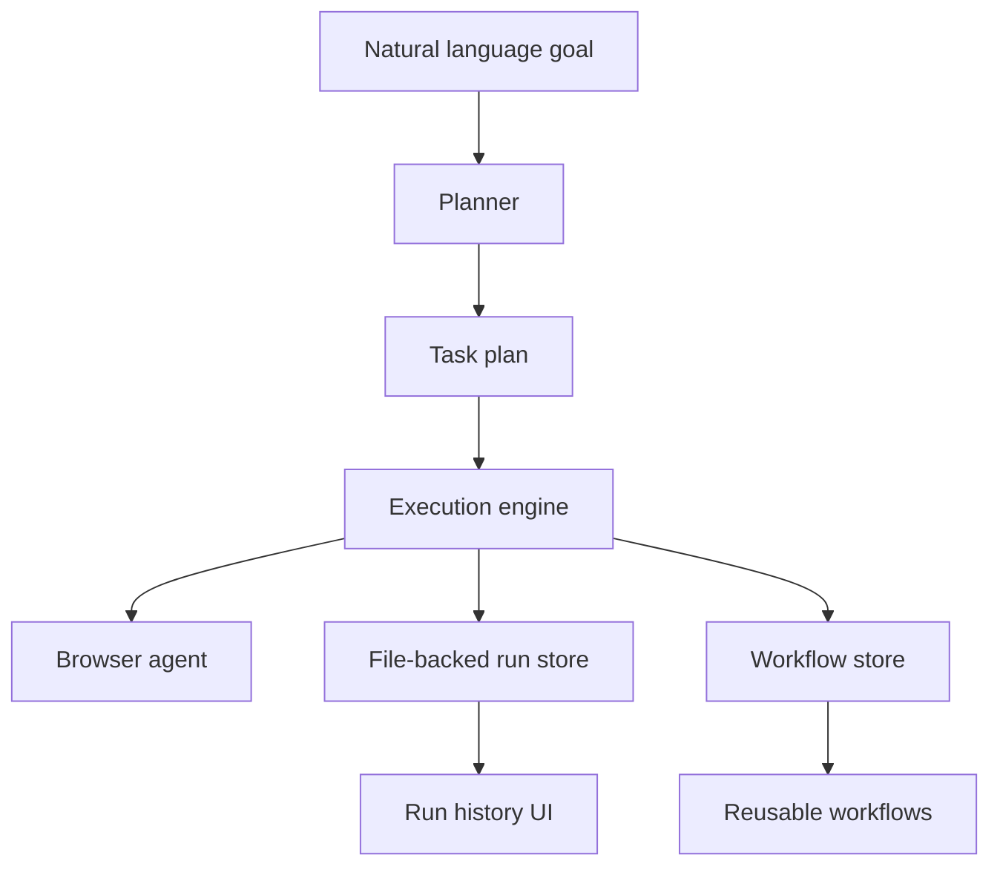

# Legwork Architecture

## Assessment

The repository started empty, so the implementation was built as a fresh modular TypeScript application instead of a refactor of existing code.

The design centers on six concrete subsystems:

1. Planner
2. Execution engine
3. Browser agent
4. History and workflow persistence
5. Controlled self-improvement layer
6. React dashboard and API surface

The system is intentionally file-backed first. That keeps the V1 stack easy to run locally, inspect, and extend before introducing queues or a database.

## Directory Layout

- `src/core/` - plan and run domain models, planner, and execution engine
- `src/browser/` - Playwright browser abstraction and recovery logic
- `src/storage/` - file-backed run persistence
- `src/workflows/` - reusable workflow storage and replay helpers
- `src/improvement/` - internal agents, observation analysis, proposal generation, branch/PR services
- `src/server/` - Express API
- `web/` - React dashboard
- `test/` - unit tests for the core behaviors
- `.legwork/` - runtime artifacts created at execution time

## Core Flow

### Planner

`src/core/planner.ts` converts a goal into a deterministic plan. It:

- Splits the goal into clauses
- Infers browser-oriented steps
- Marks potentially irreversible work with approval gates
- Appends checkpoint and consolidation steps

This is intentionally simple. It is good enough for the foundation and easy to replace with an LLM-backed planner later.

### Execution Engine

`src/core/execution-engine.ts` runs a `TaskPlan` step by step.

Behavior:

- Saves a new run before execution starts
- Emits structured events for each step
- Retries failed steps with backoff
- Pauses on approval gates
- Persists checkpoints after every state change
- Supports `resume()` from a saved checkpoint

### Browser Agent

`src/browser/playwright-browser-agent.ts` wraps Playwright and adds practical recovery:

- Fallback locator resolution for selectors, labels, placeholders, roles, and text
- Transient error detection
- Retry with page reload and backoff
- Screenshot capture into `.legwork/artifacts`

The browser agent is a concrete implementation, not a mock. It can be used directly from the execution engine or from future specialized agents.

### Persistence

`src/storage/file-run-store.ts` stores each run as JSON.
`src/workflows/workflow-store.ts` stores successful workflows as JSON and can render them as Mermaid.

This gives the app:

- Full execution history
- Checkpoint state
- Replayable workflow definitions
- Human-inspectable artifacts without needing infrastructure

## Controlled Self-Improvement System

The improvement system is designed as a constrained internal loop:

Observe -> Analyze -> Identify problems -> Generate proposals -> Design -> Implement on branch -> Test -> Security/Architecture review -> Open PR -> Human approval -> Measure impact

### Internal Agents

`src/improvement/agents.ts` defines the internal roles:

- Manager
- Performance Analyst
- Architect
- Engineer
- QA
- Security

These roles are structural first. They define responsibility, output, and permission boundaries inside the codebase.

### Observation Hooks

Run records contain:

- Status
- Step-by-step events
- Output artifacts
- Checkpoint data
- Failure messages

`src/improvement/observation-hub.ts` converts run history into summary metrics. `src/improvement/proposal-engine.ts` turns those metrics into concrete proposals.

### Branch and PR Capability

`src/improvement/branch-service.ts` can:

- Create a feature branch
- Detect GitHub CLI availability
- Push to origin

`src/improvement/pr-service.ts` can open a draft PR with `gh pr create`.

The implementation deliberately does not merge or deploy anything. Human approval remains mandatory at the PR boundary.

## API Surface

`src/server/app.ts` exposes a small JSON API:

- `POST /api/plan`
- `POST /api/runs`
- `POST /api/runs/:id/approve`
- `GET /api/runs`
- `GET /api/runs/:id`
- `POST /api/runs/:id/workflow`
- `GET /api/workflows`
- `POST /api/improvement/analyze`
- `POST /api/improvement/branch`
- `POST /api/improvement/pr`

## Reusable Workflows

Successful runs can be saved as workflows.

The workflow record stores:

- Source run
- Captured plan
- Mermaid rendering
- Placeholder input/output schemas

That is enough to support re-running and later enriching the workflow with richer parameters.

## Current Gaps

- No LLM-based planner yet
- No queue or worker process
- No durable database
- No structured spreadsheet export
- No automated code-writing agent loop
- No direct integration with a PR diff review system

Those gaps are explicit. The current code is the foundation, not the end state.
